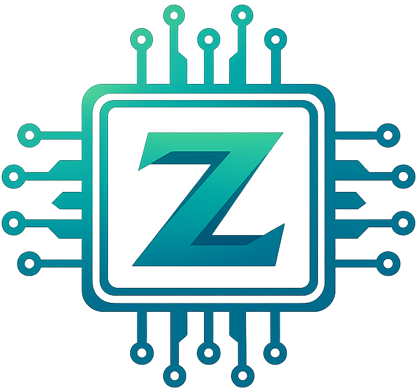

<p align="center">
  
</p>

<h1 align="center">Zilion</h1>

<p align="center">
  <b>A zillion Z80s in parallel, on your GPU.</b><br/>
  A WebGPU-accelerated, differentially-tested Zilog Z80 emulator for massively parallel batch execution.
</p>

<p align="center">
  <a href="https://www.npmjs.com/package/@neovand/zilion"></a>
  
  
  
</p>

---

Zilion runs **thousands of independent Z80 CPUs at once** as a single WebGPU compute dispatch — one CPU per GPU thread, each with its own private memory. It was born inside an [artificial-life simulator](#origin) that needed to execute tens of millions of tiny Z80 programs per second, so it is built for **scale**: give it a batch of programs, get back their final memory and registers.

```
4,096 Z80 programs · 16 instructions each · ~2.5 ms on a laptop GPU
```

## Why?

CPU emulators run one machine at a time. But a whole class of problems needs to run *many* small Z80 programs independently and cheaply:

- 🧬 **Artificial life & open-ended evolution** — soups of self-modifying machine code (à la [BFF / Computational Life](https://arxiv.org/abs/2406.19108)).
- 🧠 **Genetic programming** — evaluate an entire population of evolved Z80 programs each generation.
- 🔎 **Search & fuzzing** — brute-force or randomized exploration of program space.
- 🕹️ **Batch retro tooling** — run many short ROM snippets or test vectors in parallel.

Zilion turns "run N Z80s" into one GPU dispatch instead of N CPU loops.

## Highlights

- ⚡ **Massively parallel** — one Z80 per GPU invocation, thousands at a time.
- 🎯 **Correct** — the full documented instruction set plus **IX/IY**, **CB/ED/DDCB/FDCB** prefixes, shadow registers, and undocumented flag behavior. Continuously [differential-tested](#correctness) against a real-Z80 reference emulator.
- 🧩 **Simple API** — `create` once, `run` batches, read back memory + registers.
- 🪶 **Zero dependencies**, TypeScript-native, ships as ESM.
- 🔌 **Bring your own `GPUDevice`** or let Zilion request one.

## Install

```bash
npm install @neovand/zilion
```

Requires an environment with [WebGPU](https://caniuse.com/webgpu) (Chrome/Edge 113+, Safari 18+, Firefox 141+, or Node 22+ with a WebGPU backend).

## Quick start

```ts
import { Zilion } from '@neovand/zilion';

const z80 = await Zilion.create({ memBytes: 256 });

// A tiny program: LD A,0x42 ; INC A ; HALT
const program = [0x3e, 0x42, 0x3c, 0x76];

const result = await z80.run([program], { steps: 16 });

console.log((result.registers[0].af >> 8).toString(16)); // "43"
console.log(result.memoryOf(0)); // final 256-byte memory image

z80.destroy();
```

### Running a batch

Every entry in the array is an independent Z80 with its own memory:

```ts
// 10,000 random 32-byte programs, 128 instructions each — one dispatch.
const programs = Array.from({ length: 10_000 }, () =>
  Uint8Array.from({ length: 32 }, () => (Math.random() * 256) | 0)
);

const { registers, memory, memoryOf } = await z80.run(programs, { steps: 128 });
// registers[i], memoryOf(i) → the outcome of program i
```

### Custom starting registers

```ts
await z80.run([program], {
  steps: 64,
  init: [{ af: 0x4100, bc: 0x0008, sp: 0xfff0 }] // A=0x41, BC=8, SP=0xFFF0
});
```

## API

### `Zilion.create(options?)`

```ts
interface ZilionOptions {
  memBytes?: number; // memory per program, power of two (default 256)
  device?: GPUDevice; // provide your own, or Zilion requests one
}
```

The Z80's 16-bit address space **wraps** onto `memBytes` (so a program can't escape its instance). Smaller memories mean more programs run concurrently; larger memories reduce GPU occupancy.

### `zilion.run(programs, options)`

```ts
interface RunOptions {
  steps: number;            // instructions per program (stops early on HALT)
  init?: Z80RegisterInit[]; // optional per-program starting registers
}

interface RunResult {
  count: number;
  memBytes: number;
  memory: Uint8Array;              // flat: count * memBytes
  registers: Z80Registers[];       // af, bc, de, hl, ix, iy, sp, pc, + shadows
  memoryOf(i: number): Uint8Array; // program i's final memory
}
```

Each program is copied into its instance's memory (zero-padded or truncated to `memBytes`). Registers reset to zero except **SP = 0xFFFF** (a real Z80 reset), unless overridden via `init`.

### `zilion.destroy()`

Releases GPU resources (and the device if Zilion created it).

## How it works

Zilion generates a WGSL compute shader containing a complete Z80 core. Each shader invocation:

1. copies its program into a private in-register memory array,
2. resets a fresh CPU,
3. runs the fetch–decode–execute loop for `steps` instructions (or until `HALT`),
4. writes the final memory and registers back to storage buffers.

`workgroup_size = 64`, dispatched over `ceil(count / 64)` workgroups. Because every CPU is independent, this is embarrassingly parallel — the GPU runs as many as it has lanes for.

## Correctness

Emulator bugs hide in undocumented corners, so Zilion's Z80 core is developed against a **real-Z80 oracle** (a Fuse-lineage reference emulator that passes the `zexall`/`zexdoc` conformance suites). Thousands of random programs are run through both the GPU core and the reference each change, and their final **memory and registers** are compared — catching divergences down to individual instructions.

The core implements the full documented instruction set, the **CB**, **ED**, **DD/FD (IX/IY)**, and **DDCB/FDCB** prefix pages (including the undocumented DDCB register-copy side effect and the CPI/CPD undocumented-flag quirk), shadow registers, and `EXX`/`EX AF,AF'`.

> **Scope & honesty:** Zilion is a batch execution core, not a cycle-accurate machine emulator. There are no interrupts, no I/O ports (`IN` reads 0, `OUT` is a no-op), and no cycle timing — every instruction advances the step counter by one. The `R` refresh register and exact `HALT` idle semantics are approximated. If you need cycle-accurate single-machine emulation, use a dedicated emulator; if you need to run a zillion Z80s fast, use Zilion.

## Performance

One dispatch scales with your GPU, not your program count. As a rough sense of scale, a mid-range laptop GPU runs several thousand 16-instruction programs in a couple of milliseconds. For best throughput, keep `memBytes` small and batch as many programs as you can into a single `run`.

## Origin

Zilion was extracted from **[Algocell](https://github.com/NeoVand/algocell)**, a WebGPU artificial-life simulator where random bytes evolve into self-replicating Z80 machine code. The differential-testing methodology and the correctness fixes that made this core trustworthy came from that project.

## License

[MIT](LICENSE) © NeoVand
